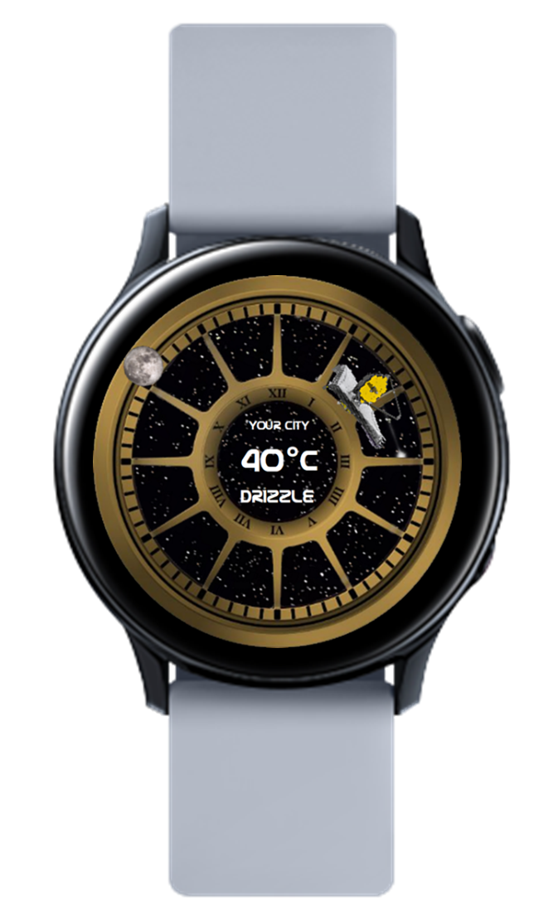
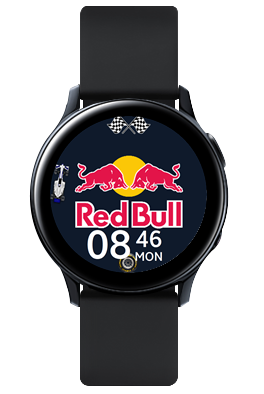
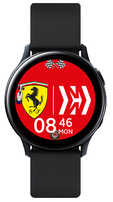
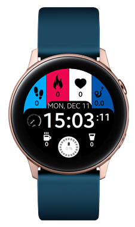
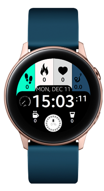

# Galaxy Smartwatch Faces for TizenOS

This project features three custom watch faces for Tizen-powered smartwatches. Each watch face has a unique design inspired by popular themes, such as Formula 1, space exploration, and minimalistic aesthetics. The watch faces were created using Galaxy Watch Studio, a powerful tool for designing custom watch faces for Samsung smartwatches with Tizen operating system.

## Watch Faces

The following watch faces are included in this project:

- F1: A watch face inspired by the world of Formula 1 racing, featuring a digital clock display. The background displays the Formula 1 teams of 2022, and with a double click, you can change the background to the team of your choice.
- James Webb Telescope: A watch face inspired by the upcoming James Webb Space Telescope, featuring a stunning space-themed background, a digital clock display, and intricate detailing. The hours are represented by the Moon and minutes by the James Webb Telescope. Additionally, this watch face displays the current temperature of your location, allowing you to stay up to date on the weather.
- Simplistic Design: A minimalistic watch face watch face with a clean and simple design. This watch face features a digital clock display and a monochromatic color scheme, which can be changed with a double click on the watch itself.

## Screenshots

Here are some screenshots of the watch faces included in this project:

  
  
  
  
  
  

## Getting Started

To use any of these watch faces, you will need a Samsung Galaxy Watch or other Tizen-powered smartwatch. You can install the watch faces onto your device by following these steps:

1. Install Galaxy Watch Studio on your computer.
2. Clone or download this repository to your local machine.
3. Open Galaxy Watch Studio and select "Open Project" from the File menu.
4. Navigate to the folder containing the watch face you want to install, and select the project file (.gwd).
5. Customize the watch face to your liking using the Galaxy Watch Studio tools.
6. Once you're happy with the design, click the "Export" button in the upper-right corner of the screen.
7. Choose the "Watch" option from the Export menu, and follow the on-screen instructions to transfer the watch face to your smartwatch.
